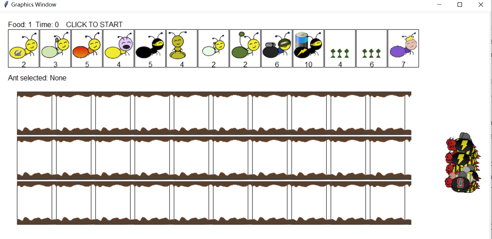

# Ants Vs. SomeBees: A Tower Defense Game

## Introduction

Ants Vs. SomeBees is a tower defense game built in Python. The game is inspired by PopCap Games' Plants Vs. Zombies and combines both functional and object-oriented programming paradigms. The gameplay focuses on strategically placing ants to protect their queen from the bees that seek to invade the territory.

[See this program on YouTube](https://youtu.be/brHZsJLfQJI)

## My Contribution

I've actively contributed to this project by implementing 8+ key features and optimizing existing functions for better performance, based on a coursework project where the code structure was provided as a skeleton. My work enhances the project's efficiency and extends its capabilities.

## Features

- Object-oriented programming paradigms
- Various types of ants with unique abilities
- Bees with different levels of toughness
- Enhanced gameplay features

## Implementation Details

### Diverse Ant Classes
- Developed classes for various types of ants like `HarvesterAnt`, `ThrowerAnt`, `QueenAnt`, etc., each with unique attributes and actions.

### Game Balance
- The `QueenAnt` class not only throws leaves but also doubles the damage of other ants in its vicinity.
  
### Advanced Gameplay Features
- **Status Effects**: Classes like `SlowThrower` and `ScaryThrower` apply debuffs to bees for a limited number of turns.
- **Dynamic Behavior**: Utilized Python's `isinstance` function to enable dynamic interactions between ants and bees based on attributes such as `is_watersafe`.

### Additional Highlights
- **Extendability**: The architecture is designed for future updates.
- **Edge Cases**: Includes mechanisms for dealing with bee direction changes and impostor queens.

## Acknowledgements

This project was created as part of online coursework at [UC Berkeley](https://inst.eecs.berkeley.edu/~cs61a/su20/proj/ants/). Special thanks to UC Berkeley for providing the opportunity and inspiration for this project.

